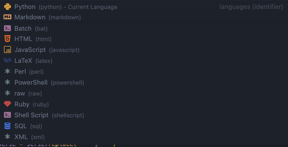
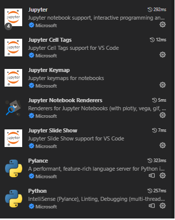

# ChatGPT Study

제목과 내용은 공부하면서 업데이트 해주세요.

# 주피터 노트북을 사용하는 이유는 무엇인가요?

Jupyter Notebook에는 기본적인 파이썬 함수가 내장되어 있고, 
Cell 마다 입력한 사항에 대해 결과를 Enter key로 바로 확인할 수 있습니다. 
Cell 마다 개발 언어를 변경 해 실행 할 수 있습니다.
또한, pandas(pd), numpy(np) package 및 matplotlib와 같은 시각화 도구를 함께 사용할 수 있습니다. 

# VSCODE에 Jupyter notebook 설치 및 실행

1. VSCODE 설치
2. Extension 설치 아래의 리스트 확인 (* VSCODE에서 추천해주는 패키지를 설치해도 됩니다.)

3. 환경 설정
  -  Jupyter Notebook에서 Python으로 작업하려면 VS Code에서 Anaconda 환경 또는 Jupyter 패키지를 설치한 다른 Python 환경을 활성화해야 합니다. 아래의 명령으로 노트북, qtconsole 및 IPython 커널을 포함한 Jupyter 시스템을 설치합니다.
    `pip install jupyter`
  - To select an environment, use the 
    `Python: Select Interpreter` command from the Command Palette (Ctrl+Shift+P).
    Global로 실행 되는 python interpreter를 선택한다.
    
  - 적절한 환경이 활성화되면 Jupyter Notebook을 만들어 열고, 코드 셀을 실행하기 위해 원격 Jupyter 서버에 연결하고, Jupyter Notebook을 Python 파일로 내보낼 수 있습니다.
  
4. 셀 실행 하기
  - 노트북이 있으면 셀 왼쪽에 있는 `실행 아이콘`을 사용하여 코드 셀을 실행할 수 있으며 출력은 코드 셀 바로 아래에 나타납니다.
  
  - 키보드 단축키를 사용하여 코드를 실행할 수도 있습니다. 명령 또는 편집 모드에서 `Ctrl+Enter`를 사용하여 현재 셀을 실행하거나 `Shift+Enter`를 사용하여 현재 셀을 실행하고 다음으로 진행합니다.
  
        
