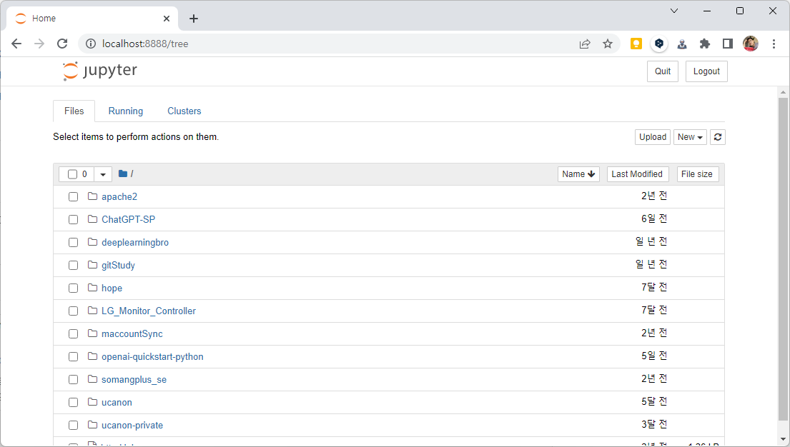

# Jupyter Notebook 소개 및 설치 방법


## 1. Jupyter Notebook의 소개

Jupyter Notebook은 대화형 컴퓨팅 환경을 제공하는 오픈소스 웹 어플리케이션입니다. 이를 사용하면 데이터 분석, 머신러닝, 데이터 시각화 등의 작업을 쉽게 수행할 수 있습니다. Jupyter Notebook을 사용하는 주요 장점은 다음과 같습니다.


1. 코드와 결과를 한 곳에서 확인할 수 있습니다.
   - Jupyter Notebook은 코드와 결과를 동일한 문서에 통합해 표시할 수 있습니다. 이렇게 하면 코드 실행 결과를 즉시 확인하고 수정할 수 있습니다.
2. 코드 실행 결과를 다른 사람과 공유하기 쉽습니다.
   - Jupyter Notebook은 웹 브라우저에서 실행되며, 실행 결과를 쉽게 공유할 수 있습니다. 다른 사람이 코드와 결과를 빠르게 이해하고 분석할 수 있습니다.
3. 다양한 프로그래밍 언어를 지원합니다.
   - Jupyter Notebook은 다양한 프로그래밍 언어를 지원하며, Python, R, Julia 등을 사용할 수 있습니다.
4. 대화형 분석이 가능합니다.
   - Jupyter Notebook은 대화형 컴퓨팅 환경을 제공하며, 데이터 분석 작업을 보다 쉽게 수행할 수 있습니다. 코드 셀에서 바로 데이터를 시각화하거나 수정하면서 결과를 바로 확인할 수 있습니다.
5. 빠른 실험과 개발이 가능합니다.
   - Jupyter Notebook은 코드 셀을 분리해서 실행할 수 있으므로, 실험적인 개발을 빠르게 수행할 수 있습니다. 따라서 빠른 시간 안에 프로토타입을 만들고 검증할 수 있습니다.


## 2. Jupyter Notebook 설치 방법

1. 파이썬 설치

   - Jupyter Notebook을 사용하려면 파이썬이 설치되어 있어야 합니다. 파이썬이 설치되어 있지 않다면 파이썬을 다운로드하여 설치해 주세요. https://www.python.org/downloads/

2. Jupyter Notebook 설치

   - 파이썬이 설치되었다면, 아래 명령어를 사용하여 Jupyter Notebook을 설치합니다.

     ```python
     pip install jupyter
     ```

3. Jupyter Notebook 실행 

   - Jupyter Notebook을 실행하려면,  Jupyter notebok을 통해서 실행한 디렉터리의 Root 경로로 이동 후에, 터미널(윈도우즈에서는 명령 프롬프트)에서 다음과 같은 명령어를 실행합니다.

   ```
   cd GitHub_Workspace
   jupyter notebook
   ```

4. jupyter Notebook 실행 화면

